  

  <strong>Pay us to break it — before someone else does.</strong>

  
  

## OpenHat Security

Authorized penetration testing for modern applications. We run a **full hunt** on systems you permit, find every hole we can, and hand you **findings plus logs of everything we touched** — so you pay us to break it before a malicious actor does.

**Website:** [openhat-website.vercel.app](https://openhat-website.vercel.app)

### $1,000 package

Flat **$1,000** engagement with a money-back path if no Critical finding lands in scope (terms in SOW).  

**Required to start:** your permission, company domain, founder LinkedIn, one application URL, and any threats you already worry about.  
**Optional:** stack and extra URLs — they only make us faster.

Start intake on the site: [https://openhat-website.vercel.app/intake](https://openhat-website.vercel.app/intake)

### Open-source products

| Project | What it is |
| --- | --- |
| [oniongate](https://github.com/openhat-security/oniongate) | Tor workstation toolkit — app routing, onion hosting, leak checks |
| [phishkit](https://github.com/openhat-security/phishkit) | Authorized AiTM + awareness assessment platform (alpha) |
| [ios-max-security](https://github.com/openhat-security/ios-max-security) | OpenHat Max Privacy for iPhone |

### Contact

- Site: [https://openhat-website.vercel.app](https://openhat-website.vercel.app)
- Email: ukryty@mailbox.org

---

<em>Authorized testing only. Written permission required before any engagement.</em>
