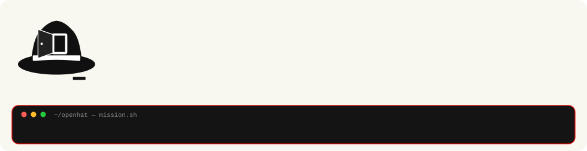
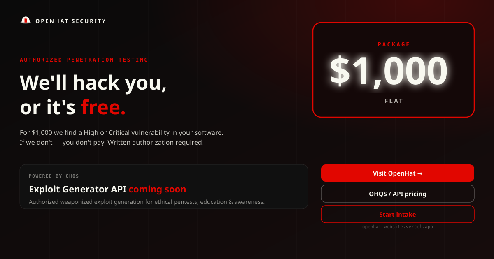

  

  <strong>Hire us to break it — before someone else does.</strong>

## OpenHat Security

Authorized penetration testing for modern applications. We run a **full hunt** on systems you permit, find every hole we can, and hand you **findings plus logs of everything we touched** — so you pay us to break it before a malicious actor does.

  
  &nbsp;
  
  &nbsp;
  

  

  <strong>For only $1,000.</strong> We find a High or Critical vulnerability in your software — if we don’t, receive an instant refund + $100 free API credits.

  

### Open source

| Project | What it is |
| --- | --- |
| [oniongate](https://github.com/openhat-security/oniongate) | Tor workstation toolkit — app routing, onion hosting, leak checks |
| [phishkit](https://github.com/openhat-security/phishkit) | Authorized AiTM + awareness assessment platform (alpha) |
| [ios-max-security](https://github.com/openhat-security/ios-max-security) | Max privacy and security settings for iPhone (iOS 18.2–26.6) |
| [ohqs](https://github.com/openhat-security/ohqs) | OpenHat quickstart — AI-assisted pentest / ethical exploit kickoff (FOSS core) |
| [runhug](https://github.com/openhat-security/runhug) | Find the best Hugging Face model, deploy on Runpod, run for pennies |
| [hfpacks](https://github.com/openhat-security/hfpacks) | Crawl Hugging Face Hub into runhug-compatible category SQLite index packs |
| [homebrew-tap](https://github.com/openhat-security/homebrew-tap) | Homebrew tap for OpenHat Security CLIs |
| [scoop-bucket](https://github.com/openhat-security/scoop-bucket) | Scoop bucket for OpenHat Security CLIs |
| [packages](https://github.com/openhat-security/packages) | apt + dnf package repos for OpenHat Security (GitHub Pages) |

### Contact

- Site: [https://openhat-website.vercel.app](https://openhat-website.vercel.app)
- Email: ukryty@mailbox.org

---

<em>Authorized, ethical offensive security services only. Written, verified permission from the organization owner required before any engagement.</em>
